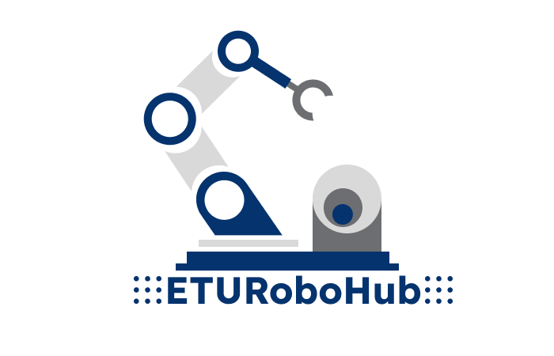

# ETU_RoboHub

**ETU RoboHub** - это проект, разработанный для знакомства студентов различных направлений с робототехникой и позволяет расширить знания в области промышленной автоматизации.

    

## Содержание

- `assets` - исходники изображений, которые вы можете встретить при прочтении `.md` файлов, либо при выполнении заданий с изображениями
- `lectures` - лекционные материалы в формате `.pdf`
- `study_materials` - задания для самостоятельной работы. В данных материалах описана теория по каждому разделу и сформулированы задания, которые вам предстоит сделать

